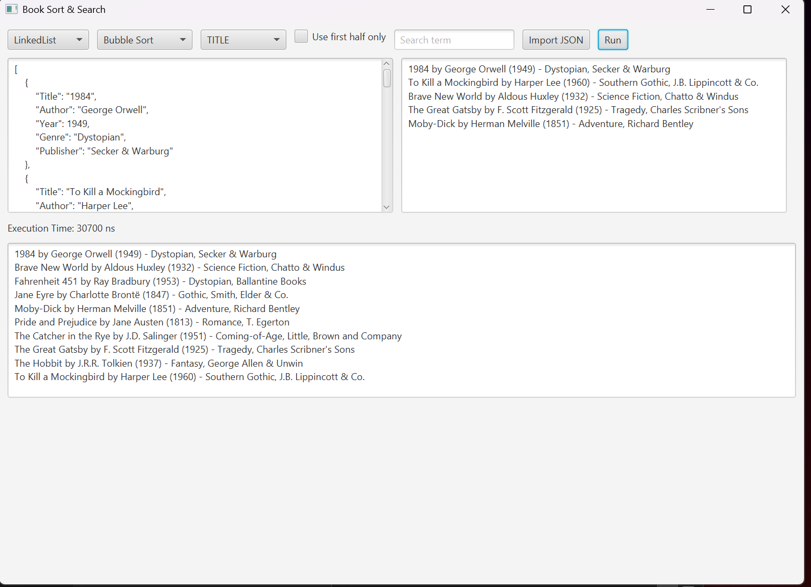
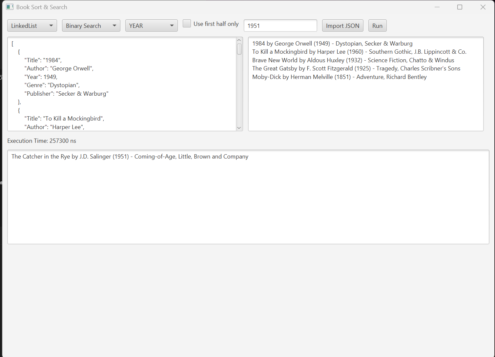
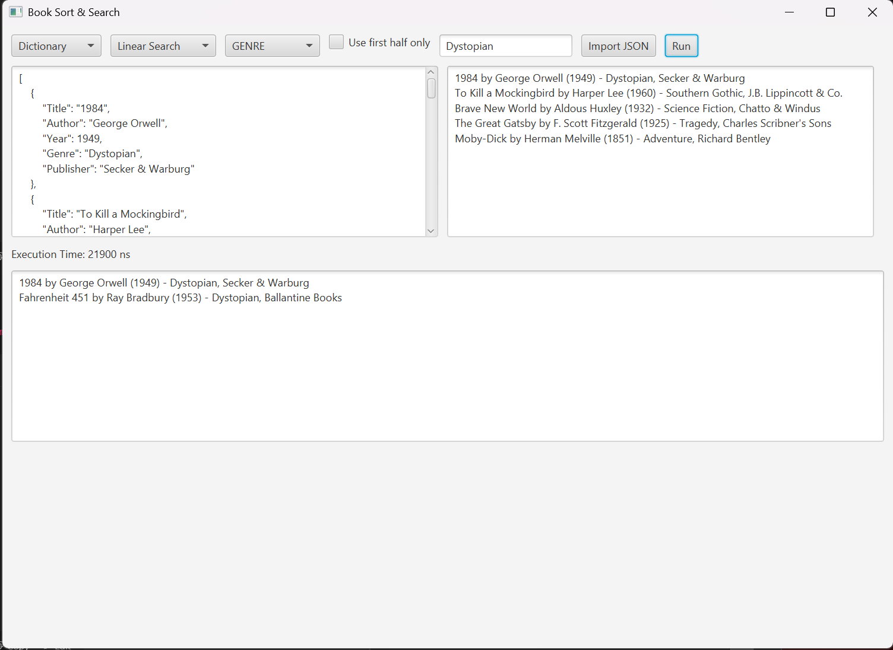

# Data Structure Assignment - Book Sort & Search App

This JavaFX-based application allows users to import a JSON file of books and perform sorting and searching operations using different data structures and algorithms.
---

## Features

- Import book dataset from a JSON file
- Choose from 3 data structures:
  - Linked List
  - Hash Set
  - Dictionary (HashMap-based)
- Perform sorting using:
  - Bubble Sort
  - Insertion Sort
  - Merge Sort
- Perform searching using:
  - Linear Search
  - Binary Search
- View execution time for each operation (in nanoseconds)
- Optionally work on the first half of the dataset
- GUI built using JavaFX


---

## How to Run

### Prerequisites

- Java 17+
- JavaFX SDK (e.g., version 21+)
- Gson JAR (place in `lib/`)

### IntelliJ Setup Instructions

1. **Open Project** in IntelliJ
2. Add the Gson JAR:
   - `Project Structure → Libraries → + → Java → select gson-2.8.x.jar`
3. Add JavaFX VM options:
   - Go to `Run → Edit Configurations`
   - Under VM options, paste:
     ```
     --module-path "lib/javafx-sdk-21/lib" --add-modules javafx.controls,javafx.fxml
     ```
4. Run `MainApp.java` as a JavaFX Application

---

## Sample JSON Format

```json
[
  {
    "Title": "To Kill a Mockingbird",
    "Author": "Harper Lee",
    "Year": 1960,
    "Genre": "Fiction",
    "Publisher": "J.B. Lippincott & Co."
  },
  {
    "Title": "1984",
    "Author": "George Orwell",
    "Year": 1949,
    "Genre": "Dystopian",
    "Publisher": "Secker & Warburg"
  }

  
]

---

## 🖼️ Screenshots

### 📊 Bubble Sort Output


### 🔍 Binary Search Output


### 🔍 Linear Search Output


---

## 📄 Sample JSON Format

```json
[
  {
    "Title": "1984",
    "Author": "George Orwell",
    "Year": 1949,
    "Genre": "Dystopian",
    "Publisher": "Secker & Warburg"
  }
]


